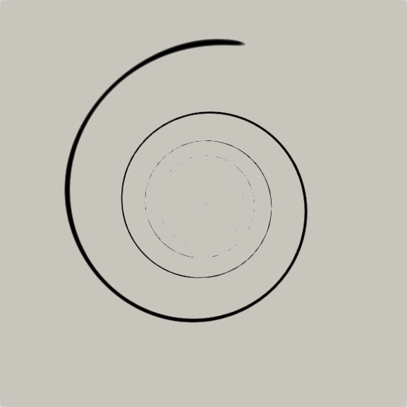
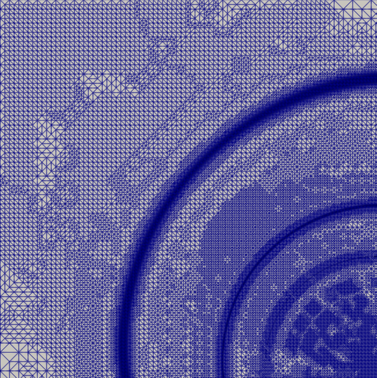

# VIAMR = adaptive mesh refinement for variational inequalities

This repository contains Python algorithms for adaptive mesh refinement (AMR) and mesh adaptation for certain variational inequalities (VIs).  VIs are, essentially, partial differential equation (PDE) problems where the solution is subject to inequalities.  The problems addressed by the library, in its current form, are scalar obstacle problems.  Many of the implemented methods work for any nonlinear operator, and the constraint set for these problems can be defined by lower- and upper-bound inequalities (box constraints).  Our algorithms apply the [Firedrake](https://www.firedrakeproject.org) finite element library.

<p align="center">
 &nbsp &nbsp &nbsp &nbsp

</p>

## Meshing for accurate set geometry

In describing algorithms we use the language of _active_ and _inactive_ sets.  In an _active set_, also known as a _contact_ set, one of the bound inequalities holds as an equality.  In the _inactive set_ the constraints are strict inequalities, so the solution satisfies a PDE, the interior condition of the VI.  A _free boundary_ is where these sets meet.

Our primary AMR goals for these free-boundary problems is to generate rapid convergence in solution norm, and to generate accurate computed free boundaries, active/contact sets, and inactive sets.  To do this, the library also contains methods which measure geometrical errors in free boundaries (edge sets in 2D) and active sets (unions of closed cells).

## Library design

Our library defines the `VIAMR` Python class in the source file `viamr/viamr.py`.  This class bundles 3 kinds of strategies for deciding _where_ to refine: free-boundary-proximity heuristics, classical residual/jump estimators applied only in inactive sets, and two whole-domain estimators already designed for Laplacian-type classical obstacle problems.  The first two strategies generalize to very nonlinear and/or degenerate operators.  These methods produce DG0 (piece-wise constant) indicators on meshes, with a $\{0,1\}$ value on each cell.  Such markings can generated diagnostically, combined by unioning, and measured geometrically by various methods of the class.

Element (cell) markings from the above strategies can be fed to either of two skeleton-based, tag-and-refine mesh refinement methods.  One method is in the [PETSc library](https://petsc.org/release/), limited to 2D, and the other is from the [Netgen](https://ngsolve.org/) via PETSc-Netgen integration [(ngspetsc)](https://github.com/NGSolve/ngsPETSc); the latter works in 2D and 3D.

Metric-based mesh adaptation, i.e. re-meshing, is also supported.  The library defines a `AMAMixin` class which implements an averaged-metric generation step, and applies the [animate](https://github.com/mesh-adaptation/animate) mesh-adaptation library to generate the new mesh.

All of the algorithms are parallel, and have excellent weak scaling.

Solution-norm error is a standard, supported way to evaluate quality.  Effectivity indices against the implemented _a posteriori_ estimators can be computed when exact solutions are available.

The library supports a diagnostic layer which measures active-set geometrical error (Jaccard distances) and free-boundary location accuracy (Hausdorff metric; for 2D meshes only).  Free-boundary accuracy is often a goal for computations using VIs.

These codes extend Stefano's Master of Science project at the University of Alaska Fairbanks (S. Fochesatto (2024). _Adaptive mesh refinement for variational inequalities_).  A paper is in progress.

## Dependencies

To get started, install Firedrake following the instructions at the [Firedrake install page](https://www.firedrakeproject.org/install.html#).  Then activate the virtual environment (venv), something like:

```
source ~/venv-firedrake/bin/activate
```

Now install [shapely](https://pypi.org/project/shapely/), [vtk](https://docs.vtk.org/en/latest/about.html), and [ngspetsc](https://github.com/NGSolve/ngsPETSc) Python packages in the venv:

```
pip install vtk ngspetsc shapely
```

To use metric-based mesh adaptation, the [animate](https://github.com/mesh-adaptation/animate) library is used.  To install this follow the instructions at the [installation wiki page](https://github.com/mesh-adaptation/docs/wiki/Installation-Instructions).

## Installation of the VIAMR library

### clone

Clone the VIAMR repository and enter the directory

```
git clone https://github.com/StefanoFochesatto/viamr.git
cd viamr/
```

### install

Either install editable with pip:

```
pip install -e .
```
or plain:

```
pip install .
```

### Using Docker

Optionally, a docker image is available, with most of the setup complete. To get started ensure that you have [Docker](https://docs.docker.com/engine/install/) installed and running on your system.  Then pull the Docker image, and run the container:

```
docker pull stefanofochesatto/viamr:latest
docker run --rm -it -v ${HOME}:${HOME} stefanofochesatto/viamr:latest
```

The `--rm` flag will remove the container once it exits, the `-it` flag runs the container with an interactive shell environment (`ctrl + d` to exit), and `-v ${HOME}:${HOME}` gives the container access to your `HOME` directory so you can navigate your files within the interactive shell environment.

Once the Docker container is up and running, you can activate the Firedrake venv as usual (see above).  You'll also want to reinstall VIAMR as the Docker image was built with a previous version of the library.

## Usage

These basic examples demonstrate refinement with the UDO, NSV and AMA methods.  First make sure that the firedrake virtual environment is active.  Then do:
```
cd examples/
python3 aol.py
```
View the output `*.pvd` using [Paraview](https://www.paraview.org/).

See `examples/README.md` for much more about the examples.

## Generating meshes

Meshes can be created using the Firedrake [utility mesh generators](https://www.firedrakeproject.org/_modules/firedrake/utility_meshes.html).  Alternatively, one can create Netgen meshes with e.g. `SplineGeometry().GenerateMesh()`.  The resulting meshes have different refinement capabilities.

## Known limitations

See the list of known limitations in the [doc string for the VIAMR class](viamr/viamr.py).

## Clearing caches

Firedrake will cache compiled weak forms.  At times, e.g. for addressing quadrature degree issues, and related irritating warnings, it may be desirable to clear such caches:
```
python3 -c "import firedrake.tsfc_interface; firedrake.tsfc_interface.clear_cache()"
```

## Testing

Software tests use [pytest](https://docs.pytest.org/en/stable/index.html).  In the main directory `VI-AMR/` do
```
pytest .
```
The tests themselves are in `tests/`.

Tests marked `@pytest.mark.parallel(nprocs=N)` are found and run automatically under `mpiexec -n N` as part of this one command.  Note that VIAMR uses its own small, dependency-free harness, in `tests/conftest.py`, which is initiated when you just run `pytest .`

For an HTML coverage report from these tests do:
```
pip install pytest-cov
pytest --cov-report html --cov=viamr tests/
firefox htmlcov/index.html
```
